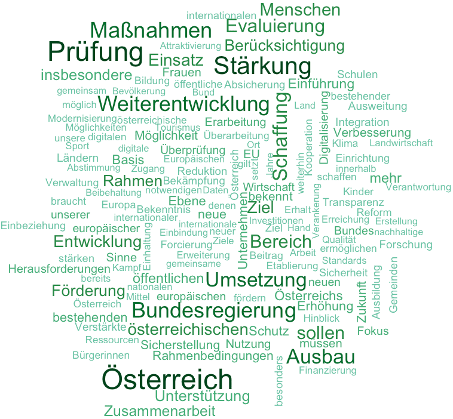

.. PDF befreites österreichisches Regierungs-Programm 2020-2024 documentation master file, created by
   sphinx-quickstart on Fri Jan 10 11:44:20 2020.
   You can adapt this file completely to your liking, but it should at least
   contain the root `toctree` directive.

=============================================
Österreichisches Regierungsprogramm 2020-2024
=============================================

- barrierefrei
- maschinenlesbar
- inoffizielle Veröffentlichung
- Quelle ist dieses :download:`Original PDF <../original/RP2020.pdf>` (lokale Kopie).

Wortwolke des Regierungsprogramms; häufige Wörter sind größer und dunkler dargestellt.

.. toctree::
   :maxdepth: 3
   :caption: Inhalt:

   00-01-Praeambel
   01-00-Staat-Gesellschaft-Transparenz
   02-00-Wirtschaft-Finanzen
   03-00-Klimaschutz-Infrastruktur-Umwelt-Landwirtschaft
   04-00-Europa-Integration-Migration-Sicherheit
   05-00-Soziale-Sicherheit-neue-Gerechtigkeit-Armutsbekaempfung
   06-00-Bildung
   README.rst
